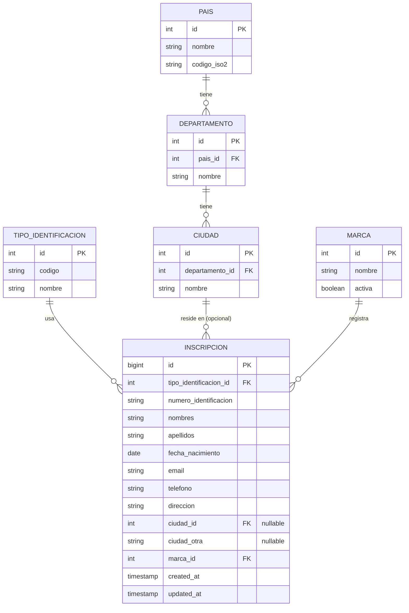

# Club de Fidelidad

Formulario de inscripción al programa de fidelidad de Americanino, American Eagle, Chevignon, Esprit, Naf Naf y Rifle.

Java 21 + Spring Boot 4.1 + MySQL en el backend, React + Vite en el frontend.

## Correr el proyecto

**Docker:**

```bash
cp .env.example .env
docker compose up --build
```

Frontend en `localhost:5173`, API en `localhost:8080`, MySQL en `localhost:3307`.

**Sin Docker** (requiere JDK 21, Maven, Node 20+, MySQL 8):

```bash
mysql -u root -p < database/dump.sql

cd backend
DB_PASSWORD=tu_contraseña ./mvnw spring-boot:run

cd frontend
npm install && npm run dev
```

**GitHub Codespaces:** botón *Code* → *Codespaces* → *Create codespace on main*. Levanta todo con Docker automáticamente.

## Pruebas

```bash
cd backend
./mvnw test
```

Validación de DTOs, servicio (Mockito), e integración end-to-end con H2.

## Modelo de datos



`ciudad_id` es opcional: si la ciudad no está en el catálogo, se guarda como texto libre en `ciudad_otra` (un `CHECK` exige al menos uno de los dos). Un mismo documento no puede inscribirse dos veces a la misma marca, pero sí a marcas distintas.

## Estructura
## Estructura

programa-fidelidad/
├── .devcontainer/
├── database/ schema.sql, seed.sql, dump.sql
├── backend/ entity, repository, dto, validation, service, controller, exception, config
├── frontend/ components, api.js, App.jsx, index.css
└── docker-compose.yml
## Endpoints

GET /api/catalogos/tipos-identificacion
GET /api/catalogos/paises
GET /api/catalogos/departamentos?paisId=
GET /api/catalogos/ciudades?departamentoId=
GET /api/catalogos/marcas
POST /api/inscripciones
GET /api/inscripciones
## Notas

Validaciones personalizadas (`@EdadMinima`, `@CiudadValida`), manejo global de errores, y frontend optimizado para performance (imágenes WebP, sin librerías de animación pesadas).

## Datos de conexión

| | |
|---|---|
| Host MySQL | `localhost` |
| Puerto MySQL | `3307` |
| Usuario | `root` |
| Base de datos | `fidelidad` |
| Contraseña | ver `.env.example` (ya viene lista, solo copiar a `.env`) |
| Backend | `http://localhost:8080` |
| Frontend | `http://localhost:5173` |
